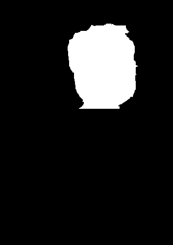

# Instance Segmentation
<!-- # MSPR ITU Dataset - Face Segmentation --->
We constructed a dataset for instance segmentation tasks. We segmented Pascal VOC 2012 dataset. In our dataset, there are 1454 images and 2695 face instances. In other words, our dataset contains 2667 face instances with their localization, classification and segmentation information. In the following figures, you may observe a frame and segmentation of face object.


|   |   |
| --- | --- |

The dataset can be accessed through [this link.](/processed-Data) 

In the directory, there are three folders which are [Annotation](processed-Data/Annotations/), [Images](processed-Data/Images/) and [processedMasks](processed-Data/processed_masks/). Images and processedMasks are the directories of frames and segmentation masks, respectively. However, in the model we performed, in Mask R-CNN, segmentation, area, category_id, image_id, bbox and iscrowd parameters should be written in JSON file.


### Parameters in JSON file

    segmentation: the encoded binary mask information. 
                  (list) of integers > [217,48,216,49,215,50,214,51,213,...,50]        
    area        : total number of pixels belong to the instance. 
                  (int) > 19918
    category_id : id of object. 
                  (str) > "face"
    image_id    : id of image. 
                  (int) > 600000
    bbox        : location of instance. 
                  (list) of int > [138, 48, 142, 173]
    iscrowd     : if the frame contains one or more instances. 
                  (bool) > 0
                  
### Creating Microsoft COCO-like Dataset for Mask R-CNN

We performed our dataset creation by using [LabelMe Annotation Tool](http://labelme.csail.mit.edu/Release3.0/). LabelMe Annotation Tool is a semi-automatic segmentation tool can be used through a browser. The method performs scene recognition at backend. Even though there are many tools for semi-automatic segmentation, we performed LabelMe since we concluded that it has a high performance in efficient time cost.

### Requirements
```
pip install json, cv2, xml, skimage, pycocotools, scipy, skimate, skimage, urlib
```
We will explain how to create a Microsoft COCO-like dataset and how to train Mask R-CNN with a custom dataset. Firstly, instances should be annotated with the tool. 

We wrote a [routine](Routine/dataset_creator.py) for converting LabelMe outputs into proper representation for training Mask R-CNN. After downloading all the outputs, they should be organized as in [./source](/Routine/Source) directory. There should be [/Annotations](/Routine/Source/Annotations), [/Images](/Routine/Source/Images) and [/Masks](/Routine/Source/Masks) folders. After this preparation, the routine can be run.

```
python3 dataset_creator.py --source [source] --destination [destination] --objective [objective] --objects [objects]
```
where;

* "source" argument is the directory of LabelMe Annotation Tool outputs.
* "destination" argument is the directory of the routine's outputs.
* "objective" argument is selection of usage of data, either 'train' or 'val'
* "objects" argument is a string of objects splitted with a comma, 'obj1,obj2,obj3'

### Functionality of Routine

Our method reads through .xml annotations and extracts parameters in the following: **"deleted_flags, polygon, bbox, iscrowd"** and mask filenames. 

* **"deleted_flags"** is a parameter that indicates if the instance is deleted after annotated. It is possible that user would like to improve the output by deleting the instance that he/she created and reannotate it again. In this case, LabelMe still keeps deleted instances. By extracting deleted_flags parameter, we can eliminate deleted instances. 

* **"polygon"** is a parameter that indicates if the instance is annotated with polygon representation. Our method currently does not provide a solution for this case. Hence, we skip the instances that are annotated with polygon. 

* **"bbox"** is the parameter that indicates the location of instance. We extract bbox information easily. However, LabelMe bbox representation and MS COCO bbox representation are not the same. While LabelMe writes [x1,y1,x2,y2], after a basic function, the list is converted into [x1,y1,w,h]

* **"iscrowd"** is the parameter that indicates if the image contains one instance or more than one instances. It has a boolean value and it is extracted from the .xml files.

After this operations, the routine extracts mask filenames and reads each binary images from Masks/ directory.

The routine reads each instances, it uses a threshold in order to write the mask with zeros and ones (black and white). 

It can be observed that the output of the tool has some noisy pixels that are not desired. The noisy pixels can be black dots at the inside the instance or white dots at the outside of the instance. In this case, holes are filled with white dots and small objects are removed. Lastly, we operate RLE Encoding in order to encode .png mask into list of integers.
